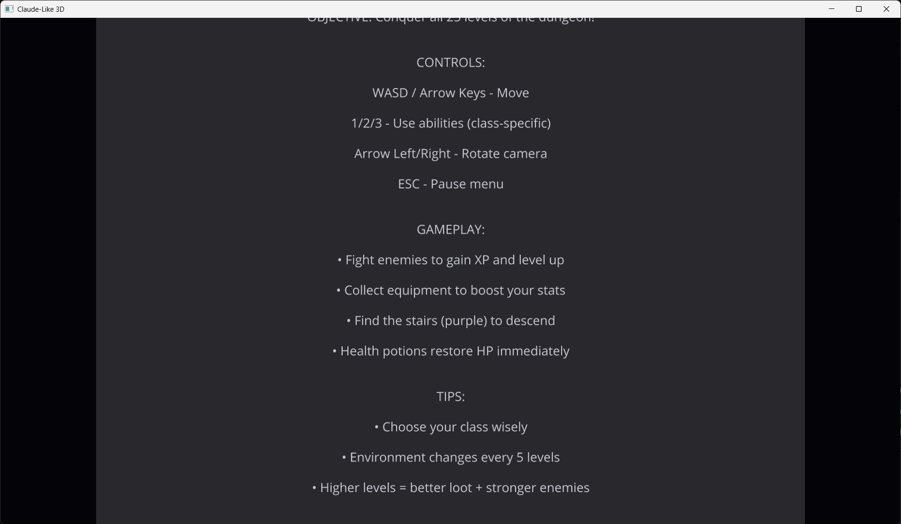

DO NOT READ THIS IT IS OUTDATED !!!! NOT RELEVANT !@!!!

A standalone visual tool for designing procedural tentacle-based creatures in real-time. Built with Ursina Engine for 3D visualization.



## Features

✅ **Real-Time 3D Preview** - See your creature as you design it
✅ **Parametric Design** - Control every aspect with intuitive buttons
✅ **Preset System** - Save, load, and share creature designs
✅ **Animation System** - Watch tentacles wave and undulate
✅ **Modular Architecture** - Easy to extend with new creature types
✅ **Choice Parameters** - Eye patterns and body shapes with cycle buttons

## Quick Start

### Installation

```bash
# From the roguelike project root
cd roguelike/

# Ensure dependencies are installed
pip install -r requirements.txt
```

### Running the Editor

```bash
# From the roguelike project root
python3 dna_editor/main.py
```

## Controls

### Camera Controls
- **Mouse Drag** - Orbit camera around creature
- **Mouse Scroll** - Zoom in/out
- **Arrow Up/Down** - Adjust camera height
- **R** - Reset camera to default position

### UI Controls
- **PREV/NEXT** - Browse through saved presets
- **NEW** - Create new creature with default parameters
- **RANDOM** - Generate random creature parameters
- **SAVE** - Save current creature as a preset
- **+/- Buttons** - Adjust numeric parameters
- **CYCLE Buttons** - Cycle through choice parameters (eye pattern, body shape)

### General
- **H** - Toggle help text overlay
- **ESC** - Exit application

## Parameters

### Body Parameters
- **Size** (0.3 - 1.2): Overall body size
- **Hue** (0 - 360): Color hue in HSV space
- **Shape**: Sphere or Ellipsoid (use CYCLE button)

### Tentacle Parameters
- **Count** (4 - 12): Number of tentacles
- **Length** (0.8 - 3.0): Base tentacle length
- **Segments** (5 - 15): Segments per tentacle (more = smoother)

### Animation Parameters
- **Speed** (0.5 - 5.0): Wave frequency (Hz)
- **Amplitude** (5 - 40): Wave strength (degrees)

### Decorations
- **Eyes** (0 - 8): Number of eyes
- **Eye Pattern**: Dual, Spider, or Ring (use CYCLE button)
- **Spikes** (0 - 30): Number of surface spikes

## Presets

The editor includes 5 example presets:

1. **Basic Horror** - Classic 8-tentacle creature
2. **Ancient Dreadnought** - Large heavily-spiked monstrosity
3. **Eye Cluster** - Many-eyed horror with short tentacles
4. **Whip Beast** - Long thin tentacles with aggressive motion
5. **Deep Dweller** - Bioluminescent deep sea horror

### Creating Custom Presets

Presets are stored as JSON files in `dna_editor/presets/`. You can:
- **Save from UI**: Click the SAVE button and enter a name
- Manually edit JSON files
- Create new presets by copying existing ones
- Share presets with others

Example preset structure:

```json
{
  "preset_name": "My Creature",
  "body_size": 0.8,
  "body_hue": 120,
  "tentacle_count": 10,
  "base_length": 2.5,
  "segments": 12,
  ...
}
```

## Architecture

### Project Structure

```
dna_editor/
├── main.py                  # Application entry point
├── creature_builder.py      # Core creature assembly
├── preset_manager.py        # Save/load system
├── ui_controls.py          # UI overlay
├── modules/                # Creature part generators
│   ├── body.py            # Body generation
│   ├── tentacle.py        # Tentacle chains
│   ├── eyes.py            # Eye decorations
│   └── spikes.py          # Spike decorations
└── presets/               # Saved creature designs
    └── examples.json      # Built-in presets
```

### Module System

Each creature part is generated by a dedicated module:

- **Body Module**: Sphere or ellipsoid with HSV color
- **Tentacle Module**: Segmented cylinder chains with tapering
- **Eye Module**: Patterns (dual, spider, ring) with pupils
- **Spike Module**: Fibonacci sphere distribution

## Extending the Editor

### Adding New Creature Types (Future)

The modular architecture makes it easy to add new creature types:

1. Create new modules in `modules/` (e.g., `slime.py`, `anemone.py`)
2. Add parameters to preset system
3. Update `creature_builder.py` to handle new type
4. Add UI controls in `ui_controls.py`

### Adding New Parameters

To add a new parameter:

1. Add default value to `preset_manager.py::get_default_parameters()`
2. Update relevant module to use the parameter
3. Add UI control in `ui_controls.py::_create_quick_controls()`

## Performance

- **Entity Count**: Displayed in UI status bar
- **Recommended**: Keep total entities under 300 for smooth performance
- **Optimization**: Lower segment count reduces entity count significantly

Example entity counts:
- Basic Horror: ~120 entities
- Ancient Dreadnought: ~250 entities
- Whip Beast (15 segments): ~150 entities

## Troubleshooting

### Editor won't start
- Ensure Ursina and dependencies are installed: `pip install -r requirements.txt`
- Check Python version: Requires Python 3.8+

### Performance issues
- Reduce tentacle segment count
- Reduce tentacle count
- Reduce spike count

### Presets not loading
- Check `dna_editor/presets/` directory exists
- Verify JSON syntax in preset files
- Check console output for error messages

## Technical Details

- **Engine**: Ursina (built on Panda3D)
- **Language**: Python 3.8+
- **Rendering**: Procedural geometry (no external models)
- **Textures**: Procedural colors (HSV-based)

## Roadmap (Future Versions)

- [ ] MVP 2.0: Slime creatures (blob-based)
- [ ] MVP 2.0: Anemone creatures (flower-like)
- [ ] Export to game-compatible format
- [ ] Undo/redo system
- [ ] Parameter presets (save favorite parameter sets)
- [ ] Texture system (patterns on body)
- [ ] Advanced animation (custom keyframes)

## Credits

Built with:
- [Ursina Engine](https://www.ursinaengine.org/) - 3D engine
- [Panda3D](https://www.panda3d.org/) - Underlying 3D framework
- Claude Code - Development assistant

## License

Part of the Claude-Like Roguelike project.

---

**For questions or issues**, please check the main project README or create an issue on the project repository.
